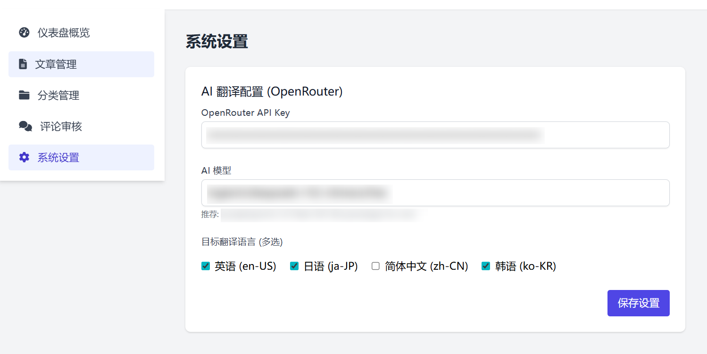

<div align="center">

# Maiburogu

**Maiburogu** 是一个轻量级、响应式且易于部署的个人博客系统源码。

它的名字来源于日文「マイブログ」（My Blog），旨在为开发者和写作爱好者提供一个纯粹、极简的写作空间。

[✨ 功能特性](#-功能特性) • [📦 部署指南](#-部署指南)

</div>

> 本仓库的部分代码由 LLM 辅助生成，LLM 生成的代码均经过开发者的审查与测试。请注意，开发者不能保证本仓库代码完全无误。使用者在将本代码部署至个人服务器后，若因代码漏洞或配置问题导致遭到攻击、数据丢失或其他形式的损害，开发者概不承担任何法律责任。请在生产环境部署前自行进行完整的安全评估。

## ✨ 功能特性

<div align="center">

  
**支持AI翻译**  
(目前还没想到其他的)

</div>

## 📦 部署指南

> 开发者不能保证本仓库代码完全无误。使用者在将本代码部署至个人服务器后，若因代码漏洞或配置问题导致遭到攻击、数据丢失或其他形式的损害，开发者概不承担任何法律责任。请在生产环境部署前自行进行完整的安全评估。

1. 将 `web/` 文件夹下的所有文件复制到您的 Web 服务器根目录中。确保所有文件和目录结构保持不变，以便应用程序能够正常运行。
2. 请确保Web服务器已正确配置 PHP 环境，并已启用以下必要的 PHP 扩展：  
   **gd**：用于图像处理功能  
   **pdo**：用于数据库访问  
   **openssl**：用于安全连接和加密功能  
   **curl**：用于 HTTP 请求功能  
   您可以通过创建包含 `phpinfo();` 的 PHP 文件来验证这些扩展是否已正确加载。
3. 在您的 MySQL 服务器中创建一个新的数据库。您可以使用 MySQL 命令行工具或 phpMyAdmin 等图形化工具完成此操作。
4. 编辑 `web/system/config/database.php` 文件，根据您的数据库环境设置正确的连接参数。
5. 将 `maiburogu.sql` 文件导入到您创建的数据库中。该文件包含了所需的所有数据表结构和初始数据。
6. 执行以下SQL语句来创建初始管理员账户：
    ```sql
     INSERT INTO `admins` (`username`, `password`, `nickname`)
     VALUES ('admin', '$2y$10$YuHCqR3mRnFs5pDROv5XMeZ19KjEzU1/ZlqKKZZMGwz57KgnVwJG6', '默认管理员');
    ```
    上述SQL语句中创建的账户密码为 123456。密码使用PHP的 PASSWORD_DEFAULT 算法进行哈希处理，确保安全性。建议在部署后立即修改此默认密码。
7. 您可以通过以下方式修改管理员密码：
    - 直接修改SQL语句中的密码哈希值
    - 部署后通过管理员后台修改（目前暂不可用）
