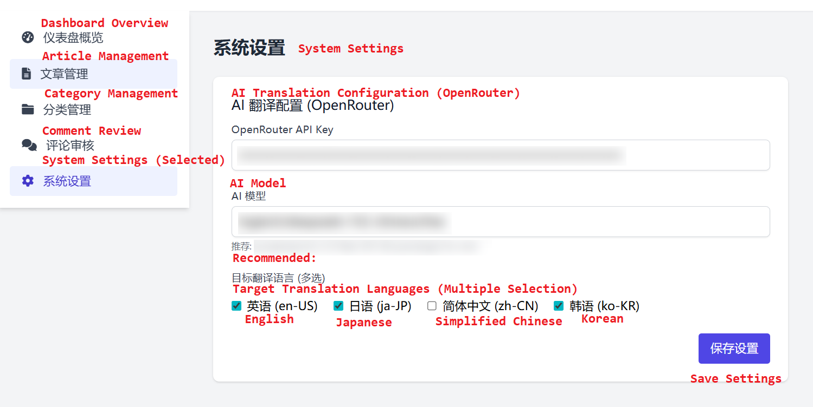

[简体中文](README.md) | [English](README_EN.md)

Translated from Simplified Chinese by AI.

<div align="center">

# Maiburogu

**Maiburogu** is a lightweight, responsive, and easy-to-deploy personal blog system source code.

The name originates from the Japanese "マイブログ" (My Blog), aiming to provide developers and writing enthusiasts with a pure, minimalist writing space.

[✨ Features](#-features) • [📦 Deployment Guide](#-deployment-guide)

</div>

> **Disclaimer:** Parts of the code in this repository were generated with the assistance of LLMs. All AI-generated code has been reviewed and tested by the developer. However, the developer cannot guarantee that the code is entirely error-free. The developer shall not be held legally responsible for any attacks, data loss, or other damages resulting from code vulnerabilities or configuration issues after deployment. Please conduct a comprehensive security assessment before deploying to a production environment.

## ✨ Features

<div align="center">

  
**AI-Powered Translation** (More features to be added)

</div>

## 📦 Deployment Guide

> The developer cannot guarantee that the code is entirely error-free. Users assume all responsibility for security risks. Please perform a full security audit before production use.

1. Copy all files from the `web/` directory to your web server's root directory. Ensure that all files and the directory structure remain intact for the application to function correctly.
2. Ensure your web server is correctly configured with a PHP environment and the following mandatory extensions are enabled:  
   **gd**: For image processing features  
   **pdo**: For database access  
   **openssl**: For secure connections and encryption  
   **curl**: For HTTP request functionality  
   You can verify if these extensions are correctly loaded by creating a PHP file containing `phpinfo();`.
3. Create a new database in your MySQL server. You can do this using the MySQL command-line tool or a graphical tool like phpMyAdmin.
4. Edit the `web/system/config/database.php` file and set the correct connection parameters according to your database environment.
5. Import the `maiburogu.sql` file into the database you created. This file contains all the necessary table structures and initial data.
6. Execute the following SQL statement to create the initial administrator account:
    ```sql
    INSERT INTO `admins` (`username`, `password`, `nickname`)
    VALUES ('admin', '$2y$10$YuHCqR3mRnFs5pDROv5XMeZ19KjEzU1/ZlqKKZZMGwz57KgnVwJG6', 'Default Admin');
    ```
    The password for the account created above is `123456`. The password is encrypted using PHP's `PASSWORD_DEFAULT` algorithm to ensure security. It is highly recommended to change this default password immediately after deployment.
7. You can modify the administrator password through the following methods:
    - Directly modify the password hash value in the SQL statement.
    - Modify it via the admin dashboard after deployment (**currently unavailable**).
